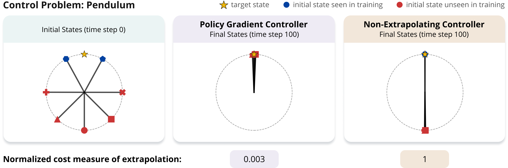
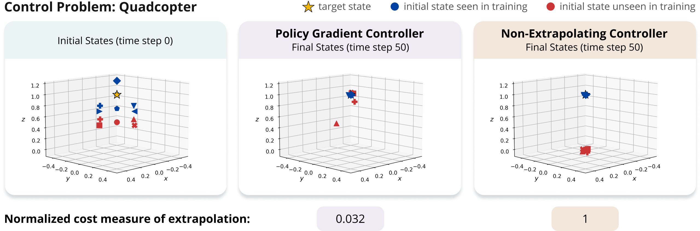

# Implicit Bias of Policy Gradient in Linear Quadratic Control: Extrapolation to Unseen Initial States

Official implementation for the experiments
in [Implicit Bias of Policy Gradient in Linear Quadratic Control: Extrapolation to Unseen Initial States](https://arxiv.org/abs/2402.07875), based on
the [PyTorch](https://pytorch.org/) and [Torchdyn](https://github.com/DiffEqML/torchdyn) libraries.

<br>
<p align="center">
  
</p>
<p align="center">
  
</p>

## Installing Requirements

Tested with Python 3.9.

- Install PyTorch from the [official website](https://pytorch.org/) (tested with version 1.11.0).
- The ```requirements.txt``` file includes additional dependencies, which can be installed via:

```
pip install -r requirements.txt
```

## 1. Liner Quadratic Control (Section 5.1)

### 1.1 Running Experiments

The following command runs experiments, in which a linear controller is trained via policy gradient over an underdetermined LQR problem, based on the given configuration
file.

```
python lqr_experiments_plan_runner.py --plan_config_path <path_to_config_file>
```

For reproducing the experiments in the paper, run the above command while replacing ```<config_path>``` with each of the configuration files below.

| Experiment                                                  | Configuration File Path                                                 |
|-------------------------------------------------------------|-------------------------------------------------------------------------|
| Identity, random A, shift systems with horizon 5 (Figure 1) | ```control/experiment_plans/lqr_experiments_plan.json```                |
| Identity, random A, shift systems with horizon 8 (Figure 3) | ```control/experiment_plans/lqr_longer_horizon_experiments_plan.json``` |
| Random A,B,Q system with horizon 5 (Figure 4)               | ```control/experiment_plans/lqr_rnd_Q_B_experiments_plan.json```        |

**Additional Notes:**

- A folder with log files and metrics will be automatically created under the directory specified by ```outputs_dir``` in the configuration file (default is ```outputs/lqr```). In particular, at the end of each run a ```summary.json``` file describing the results of the experiment will be
  created.
- The different configuration options are documents in ```common/experiment/fit_experiment_base.py```
  and ```control/experiment/lqr_co_experiment.py```.

### 1.2 Plotting Results

After running experiments using each of the configuration files specified above, the following command will print metrics aggregated across the
different runs and produce plots similar to those included in the paper.

```
python lqr_experiments_experiments_results_helper.py
```

Plots will be saved by default in the directory ```outputs/plots```.

## 2. Non-Linear Systems and Neural Network Controllers (Section 5.2)

### 2.1 Running Pendulum Experiments

The following command runs experiments, in which a neural network controller is trained via policy gradient for solving the pendulum control problem, based on the given
configuration file.

```
python pendulum_experiments_plan_runner.py --plan_config_path <path_to_config_file>
```

For reproducing the experiments in the paper, run the above command while replacing ```<config_path>``` with each of the configuration files below.

| Experiment                                                                     | Configuration File Path                                                |
|--------------------------------------------------------------------------------|------------------------------------------------------------------------|
| Policy gradient (Figure 1)                                                     | ```control/experiment_plans/pendulum_experiments_plan.json```          |
| Non-extrapolating baseline (Figure 1)                                          | ```control/experiment_plans/pendulum_no_ext_experiments_plan.json```   |
| Fitting unseen initial states for estimating minimal cost over them (Figure 1) | ```control/experiment_plans/pendulum_fit_test_experiments_plan.json``` |

**Additional Notes:**

- A folder with log files and metrics will be automatically created under the directory specified by ```outputs_dir``` in the configuration file. In
  particular, at the end of each run a ```summary.json``` file describing the results of the experiment will be created.
- It is possible to use a GPU by adding an available gpu id to the ```gpu_ids``` field in the configuration file.
- The different configuration options are documents in ```common/experiment/fit_experiment_base.py```
  and ```control/experiment/pendulum_co_experiment.py```.

### 2.2 Running Quadcopter Experiments

The following command runs experiments, in which a neural network controller is trained via policy gradient for solving the quadcopter control problem, based on the given
configuration file.

```
python quadcopter_experiments_plan_runner.py --plan_config_path <path_to_config_file>
```

For reproducing the experiments in the paper, run the above command while replacing ```<config_path>``` with each of the configuration files below.

| Experiment                                                                     | Configuration File Path                                                            |
|--------------------------------------------------------------------------------|------------------------------------------------------------------------------------|
| Policy gradient (Figure 1)                                                     | ```control/experiment_plans/quadcopter_below_experiments_plan.json```              |
| Non-extrapolating baseline (Figure 1)                                          | ```control/experiment_plans/quadcopter_below_no_ext_experiments_plan.json```       |
| Fitting unseen initial states for estimating minimal cost over them (Figure 1) | ```control/experiment_plans/quadcopter_below_fit_test_experiments_plan.json```     |
| Policy gradient (Figure 7)                                                     | ```control/experiment_plans/quadcopter_below_add_experiments_plan.json```          |
| Non-extrapolating baseline (Figure 7)                                          | ```control/experiment_plans/quadcopter_below_add_no_ext_experiments_plan.json```   |
| Fitting unseen initial states for estimating minimal cost over them (Figure 7) | ```control/experiment_plans/quadcopter_below_add_fit_test_experiments_plan.json``` |
| Policy gradient (Figure 9)                                                     | ```control/experiment_plans/quadcopter_dist_experiments_plan.json```               |
| Non-extrapolating baseline (Figure 9)                                          | ```control/experiment_plans/quadcopter_dist_no_ext_experiments_plan.json```        |
| Fitting unseen initial states for estimating minimal cost over them (Figure 9) | ```control/experiment_plans/quadcopter_dist_fit_test_experiments_plan.json```      |

**Additional Notes:**

- A folder with log files and metrics will be automatically created under the directory specified by ```outputs_dir``` in the configuration file. In
  particular, at the end of each run a ```summary.json``` file describing the results of the experiment will be created.
- It is possible to use a GPU by adding an available gpu id to the ```gpu_ids``` field in the configuration file.
- The different configuration options are documents in ```common/experiment/fit_experiment_base.py```
  and ```control/experiment/quadcopter_co_experiment.py```.

### 2.3 Plotting Results

After running experiments for the pendulum and quadcopter control problems, using each of the configuration files specified above, the following command will print metrics aggregated across the
different runs and produce plots similar to those included in the paper.

```
python nonlinear_control_experiments_results_helper.py
```

Plots will be saved by default in the directory ```outputs/plots```.

## Citation

For citing the paper you can use:

```
@article{razin2024implicit,
  title={Implicit Bias of Policy Gradient in Linear Quadratic Control: Extrapolation to Unseen Initial States},
  author={Razin, Noam and Alexander, Yotam and Cohen-Karlik, Edo and Giryes, Raja and Globerson, Amir and Cohen, Nadav},
  journal={arXiv preprint arXiv:2402.07875},
  year={2024}
}
```